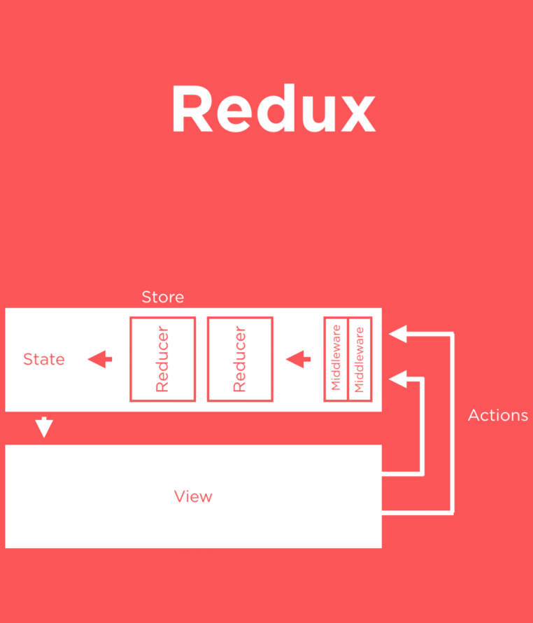

# Redux Observable

State management



[Image Source](https://blog.quizup.com/react-in-retrospective-quizup-db1dcc0dc8a1)

Asynchronous? Nope

`redux-thunk` comes into play here!

It allows us to have our actions return a method. That method takes in `dispatch`, which we can use to do async operations. 

```javascript
export function getData(){
    return (dispatch) => {
        //Make API Call
        setTimeout(() => {
            dispatch({type: DATA_AVAILABLE, data:someData});
        }, 2000);
    };
}
```

Instead of doing this

```javascript
export function getData(){
    return {type: DATA_AVAILABLE, data:data};
}
```

Dispatch transfers our data/action to reducers. 

`redux-thunk` => Middleware

`redux-observable` => Alternative Middleware for doing (better) async

The only thing that changes is our actions. 

We create something called `epics` instead of direct action methods. 

```javascript
export const loadReposEpic = action$ =>
  action$.ofType(LOADING).switchMap(action =>
    ajax("https://api.github.com/users/ahmedrizwan/repos")
      .map(payload => ({
        type: SUCCESS,
        payload: payload.response
      }))
      .catch(payload => ({
        type: ERROR
      }))
  );
```
`SwitchMap implicitly switches the request whenever a new one comes in!`

`redux-observable` gives us the ability to cancel calls! Which isn't possible with Promises! 

Promises => Guaranteed Future!

### Create a component

1.  Map state to props
2.  Map dispatch to props
3.  Use `connect` to connect the component with these mappings

```javascript
import { connect } from "react-redux";

class MyComponent extends Component {
  ...
}

const mapStateToProps = ({ isLoading, payload }) => ({
  isLoading,
  payload
});

const mapDispatchToProps = { loadRepos };

export default connect(mapStateToProps, mapDispatchToProps)(MyComponent);
```

### Create Reducer

```javascript
import { IDLE, LOADING, SUCCESS, ERROR } from "./constants";

export const reposReducer = (state = { isLoading: false }, action) => {
  switch (action.type) {
    case IDLE:
      return { isLoading: false };

    case LOADING:
      return { isLoading: true };

    case SUCCESS:
      return { isLoading: false, payload: action.payload };

    case ERROR:
      return { isLoading: false };

    default:
      return state;
  }
};
```

### Store

```javascript
const epicMiddleware = createEpicMiddleware(loadReposEpic);

export const store = createStore(reposReducer, applyMiddleware(epicMiddleware));
```

This store will be used in App.js, passed into a Provider
```javascript
class App extends Component {
  render() {
    return (
      <Provider store={store}>
        <MyComponent />
      </Provider>
    );
  }
}
```
